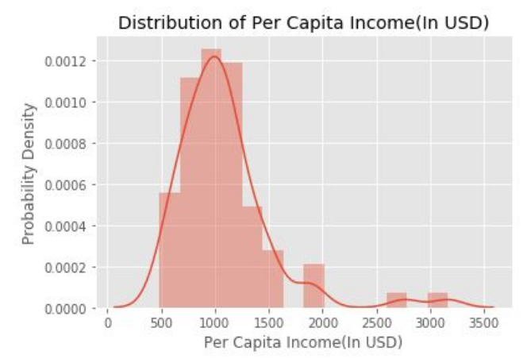
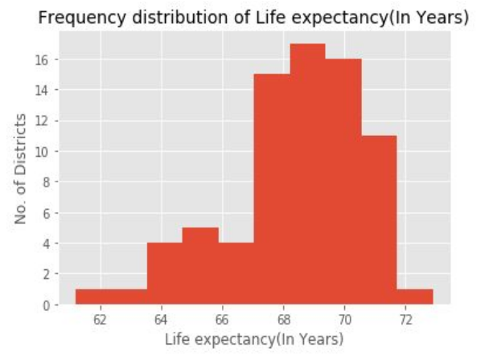
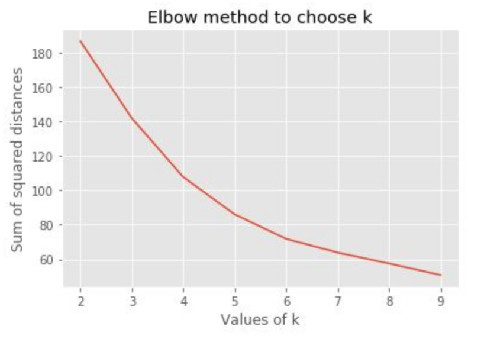
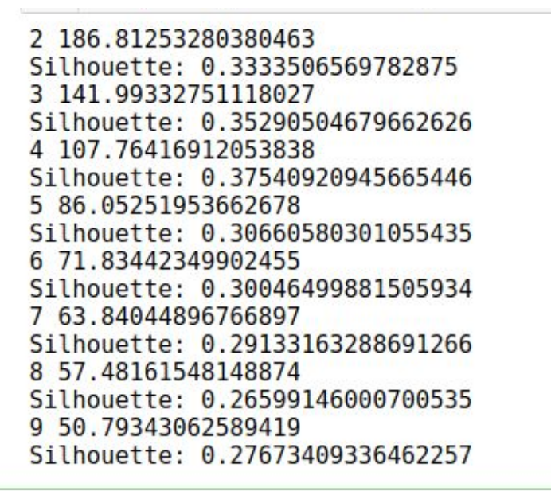
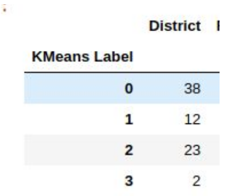
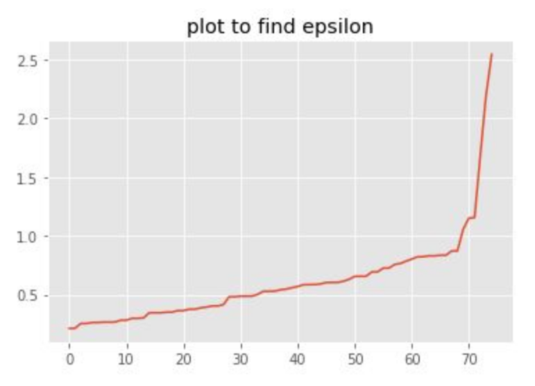
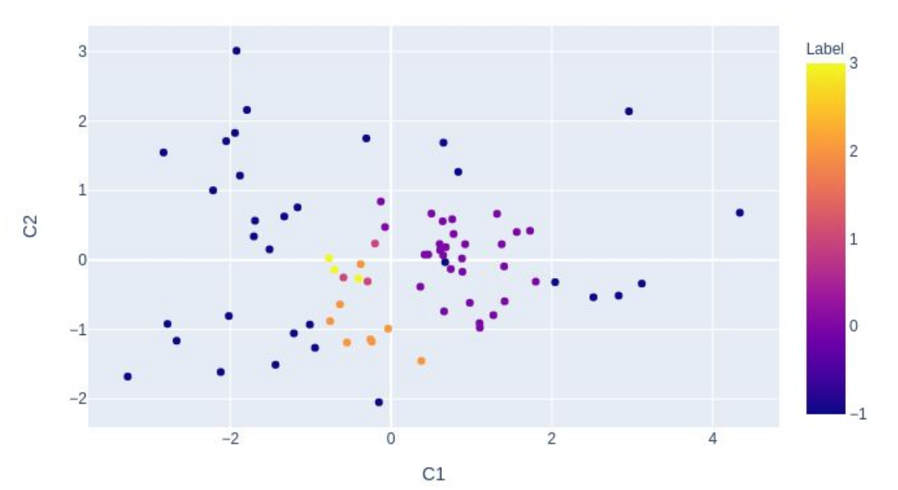
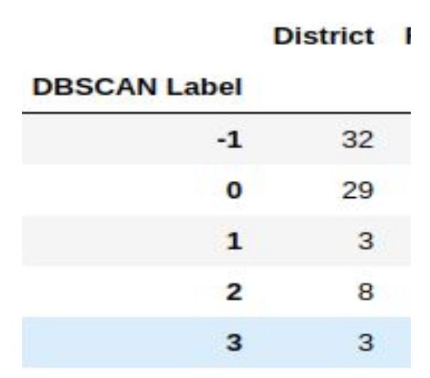
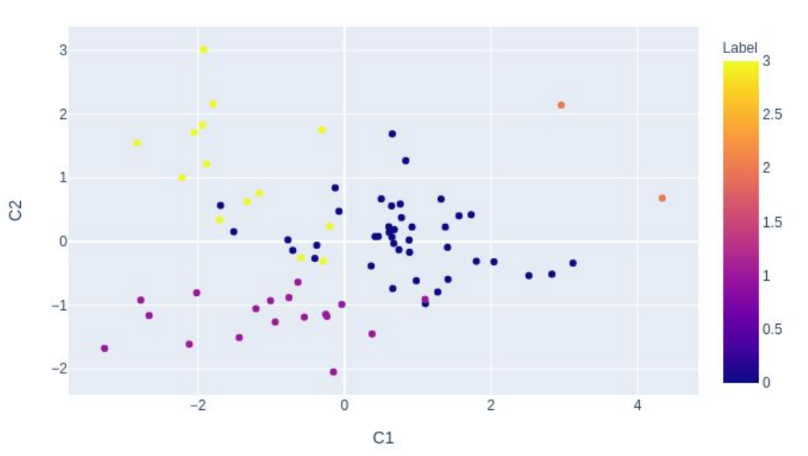
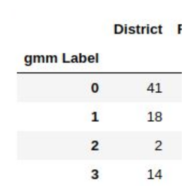

# Clustering-on-HDI-Dataset
You can try it on your own by running this [notebook](HDI.ipynb)
## Abstract

Three types of clustering K-means, DBSCAN and GMM were performed on the HDI(Human
Development Index) dataset. Tuning of parameters was difficult in the case of DBSCAN so, it
detected the majority of data as outliers. K-means and GMM were found to work well. Since the
dataset was not spherical, GMM was found to work best on our dataset. The plotting of clusters
thus formed also depicted the same.

## Data Preparation

We were provided with two datasets: literacy-rates.csv which contained literacy rates for males
and females separately in columns for each district and life-expectancy-income.csv which
contained life expectancy and per capita income of all the 75 districts. When we tried to observe
if any districts were named differently in two datasets, we found all the district names in one
dataset had spaces attached to themselves. So we stripped them away. Still, there were two
districts spelled differently. We made them the same.

## Data Exploration and Analysis
We have literacy rate for males and females, life expectancy and per capita income for all the
75 districts.

Frequency distribution of Male Literacy Rate             |  Frequency distribution of Female Literacy Rate
:-------------------------:|:-------------------------:
  |  

Fig. Frequency distribution of male and female literacy rates

From this plot, we can analyze that more number of males are literate compared to females.
The range of rate for males is 50-90% while for females it is 35-80%.

On further analysis, we found that almost 75 % of males are literate while only 56% of females
are literate.

Distribution of Per Capita Income            |  Frequency distribution of Life expectancy
:-------------------------:|:-------------------------:
  |  

The average per capita income is a little above 1000 USD while observing the plot. On
calculation, it was found to be 1080 USD. Only a few districts have it 3000 USD or more per
year.

In the maximum number of districts, the life expectancy rate is 69 years. The plot shows the
distribution of age from 62 to 72 years. The average age was found to be 68 years among all
the districts.

The literacy rate for both females(79.8%) and males(92.2%) is maximum for Kathmandu district.
The life expectancy is maximum for the peoples of Ramechhap district(72.9 years).
The per capita income is maximum for the peoples of Manang district(3166 USD).

The literacy rate for both females(32%) and males(50.9%) is minimum for the Rautahat district.
The life expectancy is minimum for the peoples of Dolpa district(61.2 years).
The per capita income is minimum for the peoples of the Bajhang district(487 USD).

## Data Preprocessing and Feature Extraction

All the data in literacy-rates.csv were for the year 2013. So we dropped the ‘Year’ column as it
was not useful for clustering. Similarly, the ‘Total’ column was the average of ‘Male’ and
‘Female’ literacy rate. So, it didn’t provide any additional information for clustering and we
dropped that too.

The life-expectancy-income.csv file had one null column as Unnamed: 3, we dropped that. Per
Capita Income was in string format, we changed it to a floating-point number.
We now merged two data frames into one of shape (75,5). The columns selected for features
are Female Literacy Rate, Male Literacy Rate, Life expectancy(In Years) and Per Capita
Income(In USD) for each of 75 districts.

During data analysis and visualization, we observed that the selected columns have different
values for different districts, so they affect the way clustering happens, which was the reason to
choose these features for our model.

We standardized features by removing the mean and scaling to unit variance as:
Z = (x-mean)/standard deviation

Scaling was done to prevent the biased impact of different features on clustering.

# Clustering
## K means
### Choosing k
1. Elbow method

<!--  -->

  

We plot the Sum of squared distances of samples to their closest cluster center vs the
number of clusters. We will choose that number of the cluster that brings maximum
deviation in the sum of square distance. This method is known as the elbow method.
The sum of square error goes on decreasing as the number of clusters increases, but we
choose that k that gives maximum deviation. With this method, in this plot, we can’t be
sure about the value of k so, we try another approach.

2. Silhouette score

The Silhouette Coefficient is calculated using the mean intra-cluster distance and the
mean nearest-cluster distance for each sample. The best value is 1 and the worst valueis -1. Values near 0 indicate overlapping clusters. Negative values generally indicate that
a sample has been assigned to the wrong cluster, as a different cluster is more similar.

<!--  -->

As the Silhouette score is maximum when the number of clusters is equal to 4 (0.3754),
we take k = 4.

### Visualization of clusters using PCA
 

<!--  -->

Kmeans classified 38 districts to be class 0, 12 districts to be class 1, 23 districts to be
class 2 and 3 districts to be class 3. Kmeans is found to be working well on this data
while analyzing the data manually.

## DBSCAN
The suggested value of min_samples was a number of dimensions of our data plus 1.
For our data, the number of dimensions is 4. So we tried min_sampes = 5. But this
classified some points to be of one cluster and all others as outliers. So I tried other
values.

### Using k-neighbors to choose the value of epsilon:
<!--   -->

From the above plot, we need to take the value of k to be 0.9 but this classified all the points
to be of the same clusters and outliers. As these values didn’t work well so I tried random
values. When we choose 
**min_samples = 3, 
  eps = 0.7,** 
it clustered given data into 4 clusters. With these values of eps and min_samples also, it
clustered the majority of points to be outliers. But these values were best among the values
tried by me.
### Visualization of clusters using PCA
 
<!--  -->
 
DBSCAN has classified 32 districts as outliers, 29 districts as cluster 0, 3 districts as cluster
1, 8 districts as cluster 2 and 3 districts as cluster 3. As dbscan has classified the majority of
points as outliers, it is not working well in this dataset.

## GMM
From the knowledge of the number of clusters from kmeans(having maximum Silhouette
score), I selected the number of components to be 4 in the Gaussian Mixture Model.
The number of iterations required for expectation maximization was found to be 16. 
From the plot below, we can see the Gaussian Mixture Model has worked well on this
data.
### Visualization of clusters using PCA
 
<!--  -->

 
Gmm has classified 41 districts of cluster 0, 18 of cluster 1, 2 as cluster 2 and 14 as
cluster 3. From the plot also, it is found to be working well.

## Conclusion
The plot of data does not seem to be spherical. As kmeans clusters data based on the distance
metric, it doesn’t work perfectly even though it has performed well by clustering Manang and
Kathmandu as different districts. DBSCAN has detected the majority of districts as outliers so it
may not be the best model. Giving attention to the non-spherical shape of data for kmeans and
the number of outliers, the difficulty of parameter tuning in DBSCAN, GMM has found to work
best which can also be seen from the plot.
